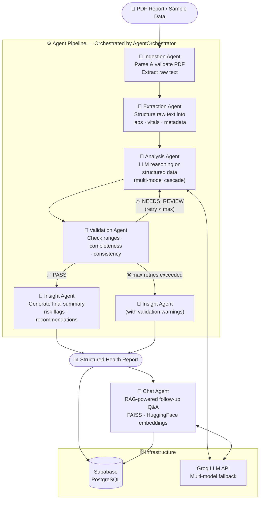

<<<<<<< HEAD
# 🩺 HIA — Agentic Health Insights System

An AI-powered multi-agent system that ingests medical blood reports and produces structured health insights through a validation-driven, orchestrated agent workflow.

The system replaces manual review with programmatic validation and feedback loops, enabling more autonomous and reliable execution.

<p align="center">
  <a href="https://github.com/Arc-424/hia/issues"></a>
  <a href="https://github.com/Arc-424/hia/stargazers"></a>
  <a href="https://github.com/Arc-424/hia/network/members"></a>
  <a href="https://github.com/Arc-424/hia/blob/main/LICENSE">
    
  </a>
</p>

<p align="center">
  <a href="#-architecture">Architecture</a> |
  <a href="#-agent-roles">Agent Roles</a> |
  <a href="#-workflow">Workflow</a> |
  <a href="#-why-its-agentic">Why It's Agentic</a> |
  <a href="#%EF%B8%8F-tech-stack">Tech Stack</a> |
  <a href="#-installation">Installation</a>
</p>

<p align="center">
  <a href="https://github.com/Arc-424/hia"></a>
</p>

---

## 🏗 Architecture

HIA is built around an **orchestrated multi-agent workflow** driven by a central `AgentOrchestrator`. Each agent has a single, well-defined responsibility. The orchestrator routes data between agents, enforces the validation loop, and decides whether to retry or escalate.



---

## 🤖 Agent Roles

| Agent | Responsibility | Input | Output |
|---|---|---|---|
| **Ingestion Agent** | Validates and parses the PDF; enforces size/page/content rules | Raw PDF file or sample text | Plain text string |
| **Extraction Agent** | Converts unstructured report text into a typed data structure (labs, vitals, patient metadata) | Raw text | `ExtractedReportData` dict |
| **Analysis Agent** | Runs LLM-based clinical reasoning with in-context learning from a session knowledge base | Structured data + system prompt | Narrative analysis string |
| **Validation Agent** | Audits the analysis for missing values, out-of-range markers, and internal inconsistencies | Structured data + analysis text | `{status, issues[]}` |
| **Insight Agent** | Produces the final patient-facing summary, risk flags, and recommendations; incorporates any validation warnings | Analysis + validation result | Final insight report |
| **Chat Agent** | Answers follow-up questions via RAG over the report text using FAISS vector search | User query + report context | Grounded natural-language answer |

---

## 🔁 Workflow

```
PDF
 └─► Ingestion Agent      — parse, validate, extract raw text
      └─► Extraction Agent — structure into labs / vitals / metadata
           └─► Analysis Agent ◄─────────────────────────────────┐
                └─► Validation Agent                             │
                     ├─ PASS ──► Insight Agent ──► Final Report  │
                     └─ NEEDS_REVIEW (retry < 3) ───────────────┘
                          └─ max retries ──► Insight Agent (with warnings)
```

The **validation–retry loop** is the core agentic behaviour: the system does not blindly accept the first LLM output. If the Validation Agent flags issues (abnormal values not addressed, missing markers, contradictory statements), the orchestrator re-invokes the Analysis Agent with an enriched prompt that includes the validation feedback, up to a configurable retry limit.

### Example

```
Input:  Blood report PDF (hemoglobin, glucose, cholesterol, liver markers)

Output: Structured health insights with:
        • Risk flags (e.g., elevated cholesterol, low hemoglobin)
        • Validation status (PASS / NEEDS_REVIEW)
        • Recommendations (lifestyle, dietary, follow-up tests)
```

---

## ✅ Why It's Agentic

| Property | How HIA implements it |
|---|---|
| **Specialised agents** | Each agent owns exactly one concern; no agent does two jobs |
| **Orchestration** | `AgentOrchestrator` drives the pipeline, passes state, and makes routing decisions |
| **Structured I/O** | Agents communicate via typed dicts, not raw strings |
| **Validation loop** | Validation Agent can reject output and trigger a retry with corrective context |
| **Decision-making** | Orchestrator decides PASS / NEEDS_REVIEW / escalate based on validation result |
| **Autonomous execution** | Pipeline runs end-to-end with minimal human intervention using validation-driven retries |
| **Model resilience** | `ModelManager` cascades across 4 LLM tiers automatically |
| **Memory / learning** | Analysis Agent maintains a session-scoped knowledge base for in-context learning |
| **RAG grounding** | Chat Agent retrieves evidence from the report before answering |

---

## 🛠️ Tech Stack

| Layer | Technology |
|---|---|
| Orchestration | Custom `AgentOrchestrator` (Python) |
| LLM backend | Groq API — 4-model cascade (Llama 4 Maverick → Llama 3.3 70B → Llama 3.1 8B → Llama3 70B) |
| RAG / vector search | LangChain · FAISS · HuggingFace `all-MiniLM-L6-v2` |
| PDF parsing | PDFPlumber · filetype |
| Auth & persistence | Supabase (PostgreSQL + Supabase Auth / Gotrue) |
| UI | Streamlit 1.42+ |

---

## 🌟 Features

- **Multi-agent pipeline** with explicit orchestration and a validation–retry loop
- **Structured extraction** — raw report text is converted to typed medical data before analysis
- **Validation Agent** — flags missing values, abnormal ranges, and inconsistencies; triggers re-analysis if needed
- **Multi-model cascade** — automatic fallback across 4 Groq-hosted LLMs
- **RAG-powered follow-up** — FAISS vector store over the report for grounded Q&A
- **Session persistence** — analyses, messages, and report text stored in Supabase
- **Daily analysis cap** — configurable limit (default 15/day) with countdown
- **Secure auth** — Supabase Auth with configurable session timeout

---

## 🚀 Installation

### Requirements

- Python 3.8+
- Supabase account
- Groq API key

### Getting Started

```bash
git clone https://github.com/Arc-424/hia.git
cd hia
pip install -r requirements.txt
```

Add credentials to `.streamlit/secrets.toml`:

```toml
SUPABASE_URL = "your-supabase-url"
SUPABASE_KEY = "your-supabase-key"
GROQ_API_KEY = "your-groq-api-key"
```

Set up the database using `public/db/script.sql`, then run:

```bash
streamlit run src/main.py
```

---

## 📁 Project Structure

```
hia/
├── src/
│   ├── main.py                        # Streamlit entry point
│   ├── agents/
│   │   ├── orchestrator.py            # AgentOrchestrator — pipeline driver
│   │   ├── ingestion_agent.py         # PDF parsing & validation
│   │   ├── extraction_agent.py        # Raw text → structured medical data
│   │   ├── analysis_agent.py          # LLM clinical reasoning + in-context learning
│   │   ├── validation_agent.py        # Range checks, completeness, consistency
│   │   ├── insight_agent.py           # Final summary, risk flags, recommendations
│   │   ├── chat_agent.py              # RAG follow-up Q&A
│   │   └── model_manager.py           # Multi-model cascade & fallback
│   ├── services/
│   │   └── ai_service.py              # Service layer consumed by UI
│   ├── config/
│   │   ├── app_config.py
│   │   ├── prompts.py
│   │   └── sample_data.py
│   ├── auth/
│   ├── components/
│   └── utils/
│       ├── pdf_extractor.py
│       └── validators.py
└── public/
    └── db/
        ├── script.sql
        └── schema.png
```

---

## 👥 Contributing

Contributions are welcome. See [CONTRIBUTING.md](CONTRIBUTING.md) for the development workflow and coding standards.

| Avatar | Name | GitHub | Role |
|--------|------|--------|------|
|  | Archit Choudhary | [Arc-424](https://github.com/Arc-424) | Project Creator & Maintainer |

## 📄 License

MIT — see [LICENSE](LICENSE).

## 🙋‍♂️ Author

Created by Archit Choudhary
=======
# agentic-health-insights-system
Agentic AI system for medical report analysis using a validation-driven, multi-agent workflow with orchestration, structured extraction, and feedback loops.
>>>>>>> 12f15259717aa47ef2b84fb4663ba666387fa570
